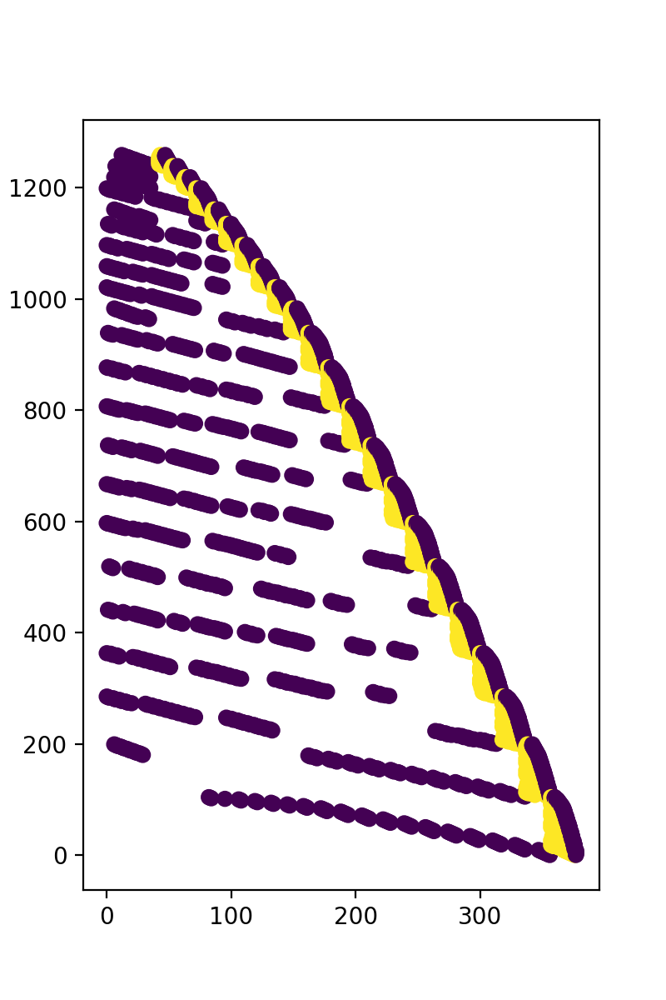

## ALS推荐系统优化

- 矩阵特征分析
- 稠密阵运算 => 稀疏阵运算
- 串行程序 => 并行程序
- 编译优化


### 矩阵特征分析

- 矩阵样式:

  

- [x] 稀疏阵

### 稀疏阵运算

- 首先我自己实现了个`csr_sparse`的基础数据结构及运算库. 

  - 向量元素, 向量结构及相应算法:

  ```c
  typedef unsigned long ul;
  typedef unsigned long long ull;
  
  typedef struct {
      ul id;
      VALUE_TYPE val;
  } pair;
  
  int pair_cmp(const void *a, const void *b) {
      return ((pair *) a)->id < ((pair *) b)->id ? -1 : 1;
  }
  
  typedef struct {
      pair *src;
      ul len, _REAL_LEN; /// 动态维护向量长度
  } vector;
  #define vector_get_element(v, indx) (v->src[indx])
  #define any_of_vector(v, i) for(pair*i=v->src; i<v->src+v->len;++i)
  #define end_of_vector(v) (v->src+v->len)
  
  void clean_vector(vector *v) {
      qsort(v->src, v->len, sizeof(pair), pair_cmp);
  }
  
  void del_vector(vector *v) {
      free(v->src);
      free(v);
  }
  
  vector *new_vector() { /// 创建一个向量
      MALLOC(ret, vector, 1);
      ret->len = 0;
      ret->_REAL_LEN = 1;
      ret->src = RMALLOC(pair, 1);
      return ret;
  }
  
  void veccpy(vector *dest, vector *src) {
      dest->_REAL_LEN = src->_REAL_LEN;
      dest->len = src->len;
      dest->src = (pair *) realloc(dest->src, sizeof(pair) * dest->_REAL_LEN);
      memcpy(dest->src, src->src, sizeof(pair) * dest->len);
  }
  
  void vector_push_back(vector *v, pair val) {
      if (v->len == v->_REAL_LEN) {
          v->_REAL_LEN += 10;
          v->src = (pair *) realloc(v->src, sizeof(pair) * v->_REAL_LEN);
      }
      v->src[v->len].id = val.id;
      v->src[v->len++].val = val.val;
  }
  ```

  - 利用邻接表实现CSR矩阵和相应算法.
  
  ```c
  typedef struct {
      ul m, n, nnz;
      vector **src;
  } csr_matrix;
  #define anyrow_of_csr(csr, i) for(vector**i=csr->src;i<csr->src+csr->m;++i)
  #define indx_of_iter(csr, i) (i-csr->src)
  
  void clean_csr_matrix(csr_matrix *csr) {
      for (int i = 0; i < csr->m; ++i)clean_vector(csr->src[i]);
  }
  
  csr_matrix *new_csr_matrix(size_t m, size_t n) {
      MALLOC(res, csr_matrix, 1);
      res->m = m;
      res->n = n;
      res->src = RMALLOC(vector*, m);
      anyrow_of_csr(res, i) (*i) = new_vector();
      return res;
  }
  
  void del_csr(csr_matrix *csr) {
      anyrow_of_csr(csr, i)del_vector((*i));
      free(csr->src);
  }
  
  csr_matrix *load_mtx(char *filename) {
      FILE *fp = fopen(filename, "r");
      char line[105];
      while (fgets(line, 100, fp), line[0] == '%');
      size_t n, m, nnz, row, col;
      VALUE_TYPE val;
      sscanf(line, "%lu%lu%lu", &m, &n, &nnz);
      csr_matrix *ret = new_csr_matrix(m, n);
      ret->nnz = nnz;
      for (int i = 0; i < nnz; ++i) {
          fscanf(fp, "%lu%lu%f", &row, &col, &val);
          vector_push_back(ret->src[row - 1], (pair) {col - 1, val});
      }
      fclose(fp);
      clean_csr_matrix(ret);
      return ret;
  }
  
  void csr_to_matrix(csr_matrix *a, VALUE_TYPE *dest) {
      anyrow_of_csr(a, i)any_of_vector((*i), j)dest[(i - a->src) * a->n + j->id] = j->val;
  }
  
  void csr_to_vec(csr_matrix*src, vector*vec) {
      anyrow_of_csr(src, i)any_of_vector((*i), j)vector_push_back(vec, (pair){(i-src->src)*src->n+j->id,j->val});
  }
  
  void vec_to_csr(vector *src, unsigned n, csr_matrix *c) {
      c->nnz = src->len;
      any_of_vector(src, i)vector_push_back(c->src[i->id / n], (pair) {i->id % n, i->val});
  }
  
  void vecT_to_csr(vector *src, unsigned n, csr_matrix *c) {
      c->nnz = src->len;
      any_of_vector(src, i)vector_push_back(c->src[i->id % n], (pair) {i->id / n, i->val});
  }
  
  void csr_transpose(csr_matrix *t, csr_matrix *src) {
      vector *vec = new_vector();
      for (int i = 0; i < src->m; ++i)
          any_of_vector(src->src[i], j)vector_push_back(vec, (pair) {i * src->n + j->id, j->val});
      clean_vector(vec);
      vecT_to_csr(vec, src->n, t);
      free(vec);
  }
  
  void csrvec(csr_matrix *a, vector *v, vector *res) {
      if (vector_get_element(v, v->len - 1).id >= a->n)return;
      int indx = 0;
      anyrow_of_csr(a, i) {
          pair *pa = (*i)->src, *pv = v->src;
          pair *enda = end_of_vector((*i)), *endv = end_of_vector(v);
          VALUE_TYPE sum = 0;
          while (pa < enda && pv < endv) {
              while (pa->id < pv->id && pa < enda)++pa;
              if (pa == enda)break;
              while (pv->id < pa->id && pv < endv)++pv;
              if (pv == endv)break;
              sum += pa->val * pv->val;
              ++pa, ++pv;
          }
          if (fabsf(sum) >= 1e-5)vector_push_back(res, (pair) {indx, sum});
          ++indx;
      }
  }
  
  void csrcsr_to_vec(csr_matrix *a, csr_matrix *b, vector *res) {
      if (a->n != b->m) return;
      unsigned cscm = b->n, cscn = b->m, indx = 0;
      csr_matrix *csc = new_csr_matrix(cscm, cscn);
      csr_transpose(csc, b);
      anyrow_of_csr(a, i) { /// a rows
          anyrow_of_csr(csc, j) { /// b cols
              pair *pa = (*i)->src, *pb = (*j)->src;
              pair *enda = end_of_vector((*i)), *endb = end_of_vector((*j));
              VALUE_TYPE sum = 0;
              while (pa < enda && pb < endb) {
                  while (pa->id < pb->id && pa < enda)++pa;
                  if (pa == enda)break;
                  while (pb->id < pa->id && pb < endb)++pb;
                  if (pb == endb)break;
                  sum += pa->val * pb->val;
                  ++pa, ++pb;
              }
              if (fabsf(sum) >= 1e-5f)vector_push_back(res, (pair) {indx, sum});
              ++indx;
          }
      }
      del_csr(csc);
  }
  
  void csrcsr(csr_matrix *c, csr_matrix *a, csr_matrix *b) {
      vector *res = new_vector();
      csrcsr_to_vec(a, b, res);
      vec_to_csr(res, b->n, c);
      del_vector(res);
  }
  
  void matmat_to_vec(vector *res, float *A, float *B, int m, int k, int n, ul*one_base_cal_index) {
      VALUE_TYPE sum;
      res->len = 0;
      if (!one_base_cal_index) {
          for (int i = 0; i < m; i++)
              for (int j = 0; j < n; j++) {
                  sum = 0;
                  for (int kk = 0; kk < k; kk++)//C[i * n + j] += A[i * k + kk] * B[kk * n + j];
                      sum += A[i * k + kk] * B[kk * n + j];
                  if (fabsf(sum) >= 1e-5f)vector_push_back(res, (pair) {i * n + j, sum});
              }
      } else {
          ul len = one_base_cal_index[0];
          ul *p = one_base_cal_index + 1;
          while (len--) {
              sum = 0;
              for (int kk = 0; kk < k; kk++)sum += A[(*p / n) * k + kk] * B[kk * n + (*p % n)];
              vector_push_back(res, (pair) {*p, sum});
              ++p;
          }
      }
  }
  
  void matmat_transB_to_vec(vector *res, float *A, float *BT, int m, int k, int n, ul*one_base_cal_index) {
      VALUE_TYPE sum;
      res->len = 0;
      if (!one_base_cal_index) {
          for (int i = 0; i < m; i++)
              for (int j = 0; j < n; j++) {
                  sum = 0;
                  for (int kk = 0; kk < k; kk++)//C[i * n + j] += A[i * k + kk] * B[kk * n + j];
                      sum += A[i * k + kk] * BT[j * k + kk];
                  if (fabsf(sum) >= 1e-5f)vector_push_back(res, (pair) {i * n + j, sum});
              }
      } else {
          ul len = one_base_cal_index[0];
          ul *p = one_base_cal_index + 1;
          while (len--) {
              sum = 0;
              for (int kk = 0; kk < k; kk++)sum += A[(*p / n) * k + kk] * BT[(*p % n) * k + kk];
              vector_push_back(res, (pair) {*p, sum});
              ++p;
          }
      }
  }
  ```
  
- 将与R和Rp相关的矩阵运算替换为稀疏矩阵运算.

  ```c
  void updateX_recsys(csr_matrix *csr, float *X, float *Y, int m, int n, int f, float lamda,
                      double *time_prepareA, double *time_prepareb, double *time_solver) {
      struct timeval t1, t2;
  
      // malloc smat (A) and svec (b)
      float *smat = (float *) malloc(sizeof(float) * f * f);
      float *svec = (float *) malloc(sizeof(float) * f);
      int mxnzr = 0;
      anyrow_of_csr(csr, i)mxnzr = max(mxnzr, (*i)->len);
      float *sY = (float *) malloc(sizeof(float) * mxnzr * f);
      float *sYT = (float *) malloc(sizeof(float) * mxnzr * f);
      float *ru = (float *) malloc(sizeof(float) * mxnzr);
  
  
      anyrow_of_csr(csr, u) {
          gettimeofday(&t1, NULL);
          float *xu = X + indx_of_iter(csr, u) * f;
          vector *this_vec = *u;
          // find nzr (i.e., #nonzeros in the uth row of R)
          int nzr = this_vec->len;
  
          // malloc ru (i.e., uth row of R) and insert entries into it
          float *rup = ru;
          int count = 0;
          any_of_vector(this_vec, j)*(rup++) = j->val;
  
          // fill sY, according to the sparsity of the uth row of R
          any_of_vector(this_vec, j)memcpy(&sY[(count++) * f], &Y[j->id * f], sizeof(float) * f);
  
          // transpose sY to sYT
          transpose(sYT, sY, nzr, f);
  
          // multiply sYT and sY, and plus lamda * I
          matmat(smat, sYT, sY, f, nzr, f);
          for (int i = 0; i < f; ++i)
              smat[i * f + i] += lamda;
  
          gettimeofday(&t2, NULL);
          *time_prepareA += (t2.tv_sec - t1.tv_sec) * 1000.0 + (t2.tv_usec - t1.tv_usec) / 1000.0;
  
          // compute b (i.e., svec) by multiplying sYT and the uth row of R
          gettimeofday(&t1, NULL);
          matvec(sYT, ru, svec, f, nzr);
          gettimeofday(&t2, NULL);
          *time_prepareb += (t2.tv_sec - t1.tv_sec) * 1000.0 + (t2.tv_usec - t1.tv_usec) / 1000.0;
  
          // solve the system of Ax=b, and get x = the uth row of X
          gettimeofday(&t1, NULL);
          int cgiter = 0;
          cg(smat, xu, svec, f, &cgiter, 100, 0.00001);
          gettimeofday(&t2, NULL);
          *time_solver += (t2.tv_sec - t1.tv_sec) * 1000.0 + (t2.tv_usec - t1.tv_usec) / 1000.0;
      }
      free(ru), free(sY), free(sYT), free(smat), free(svec);
  }
  
  void updateY_recsys(csr_matrix *csc, float *X, float *Y, int m, int n, int f, float lamda,
                      double *time_prepareA, double *time_prepareb, double *time_solver) {
      struct timeval t1, t2;
  
      float *smat = (float *) malloc(sizeof(float) * f * f);
      float *svec = (float *) malloc(sizeof(float) * f);
      int mxnzc = 0;
      anyrow_of_csr(csc, i)mxnzc = max(mxnzc, (*i)->len);
      float *sX = (float *) malloc(sizeof(float) * mxnzc * f);
      float *sXT = (float *) malloc(sizeof(float) * mxnzc * f);
      float *ri = (float *) malloc(sizeof(float) * mxnzc);
  
      anyrow_of_csr(csc, i) {
          gettimeofday(&t1, NULL);
          float *yi = Y + indx_of_iter(csc, i) * f;
          vector *this_vec = *i;
          int nzc = this_vec->len;
  
          float *rip = ri;
          int count = 0;
          any_of_vector(this_vec, j)*(rip++) = j->val;
          any_of_vector(this_vec, j)memcpy(&sX[(count++) * f], &X[j->id * f], sizeof(float) * f);
  
          transpose(sXT, sX, nzc, f);
          matmat(smat, sXT, sX, f, nzc, f);
          for (int j = 0; j < f; j++)
              smat[j * f + j] += lamda;
  
          gettimeofday(&t2, NULL);
          *time_prepareA += (t2.tv_sec - t1.tv_sec) * 1000.0 + (t2.tv_usec - t1.tv_usec) / 1000.0;
  
          gettimeofday(&t1, NULL);
          matvec(sXT, ri, svec, f, nzc);
          gettimeofday(&t2, NULL);
          *time_prepareb += (t2.tv_sec - t1.tv_sec) * 1000.0 + (t2.tv_usec - t1.tv_usec) / 1000.0;
  
          gettimeofday(&t1, NULL);
          int cgiter = 0;
          cg(smat, yi, svec, f, &cgiter, 100, 0.00001);
          gettimeofday(&t2, NULL);
          *time_solver += (t2.tv_sec - t1.tv_sec) * 1000.0 + (t2.tv_usec - t1.tv_usec) / 1000.0;
      }
      free(smat), free(svec), free(sX), free(sXT), free(ri);
  }
  ```


### 串行程序 => 并行程序

- 分析程序流程中可并行化的代码块. 显然, update*_recsys函数中的外层循环的是前后无关的. 

- 所以, 可以现针对update*_recsys进行并行优化, 得到:

  ```c
  ul block;
  #define range(i, a, b) for(vector**i=a;i<b;++i)
  typedef struct {
      csr_matrix *csr;
      float *X, *Y;
      int f;
      float lamda;
      double *time_prepareA, *time_prepareb, *time_solver;
      ul block_id;
  }thread_data;
  
  void*cal_one_block(void*data) {
      thread_data *params = (thread_data *) data;
      ul real_m = params->csr->m / block;
      vector **start = params->csr->src + (params->block_id) * real_m;
      vector **end = min(params->csr->src + (params->block_id + 1) * real_m, params->csr->src + params->csr->m);
      struct timeval t1, t2;
      float *smat = (float *) malloc(sizeof(float) * params->f * params->f);
      float *svec = (float *) malloc(sizeof(float) * params->f);
      int mxnzr = 0;
      range(i,start,end)mxnzr = max(mxnzr, (*i)->len);
      float *sY = (float *) malloc(sizeof(float) * mxnzr * params->f);
      float *sYT = (float *) malloc(sizeof(float) * mxnzr * params->f);
      float *ru = (float *) malloc(sizeof(float) * mxnzr);
      double a = 0, b = 0, c = 0;
      range(u, start, end) {
          gettimeofday(&t1, NULL);
          float *xu = params->X + indx_of_iter(params->csr, u) * params->f;
          vector *this_vec = *u;
          int nzr = this_vec->len;
          float *rup = ru;
          int count = 0;
          any_of_vector(this_vec, j)*(rup++) = j->val;
          any_of_vector(this_vec, j)
              memcpy(&sY[(count++) * params->f], &params->Y[j->id * params->f], sizeof(float) * params->f);
          transpose(sYT, sY, nzr, params->f);
          matmat(smat, sYT, sY, params->f, nzr, params->f);
          for (int i = 0; i < params->f; ++i)
              smat[i * params->f + i] += params->lamda;
          gettimeofday(&t2, NULL);
          a += ((t2.tv_sec - t1.tv_sec) * 1000.0 + (t2.tv_usec - t1.tv_usec) / 1000.0) / block;
          gettimeofday(&t1, NULL);
          matvec(sYT, ru, svec, params->f, nzr);
          gettimeofday(&t2, NULL);
          b += ((t2.tv_sec - t1.tv_sec) * 1000.0 + (t2.tv_usec - t1.tv_usec) / 1000.0) / block;
          gettimeofday(&t1, NULL);
          cg(smat, xu, svec, params->f, 100, 0.00001);
          gettimeofday(&t2, NULL);
          c += ((t2.tv_sec - t1.tv_sec) * 1000.0 + (t2.tv_usec - t1.tv_usec) / 1000.0) / block;
      }
      free(ru), free(sY), free(sYT), free(smat), free(svec);
      *params->time_prepareA += a;
      *params->time_prepareb += b;
      *params->time_solver += c;
      return NULL;
  }
  
  void update(csr_matrix *csr, float *X, float *Y, int f, float lamda,
                      double *time_prepareA, double *time_prepareb, double *time_solver) {
      pthread_t ls[block+1];
      thread_data dts[block+1];
      for(int i=0;i<block+1;++i){
          dts[i].csr = csr;
          dts[i].time_solver = time_solver;
          dts[i].X = X;
          dts[i].Y = Y;
          dts[i].lamda = lamda;
          dts[i].time_prepareA = time_prepareA;
          dts[i].time_prepareb = time_prepareb;
          dts[i].f = f;
          dts[i].block_id = i;
          pthread_create(ls + i, NULL, cal_one_block, (void *) (dts + i));
      }
      for(int i=0;i<block+1;++i)pthread_join(ls[i], NULL);
  }
  ```


### 编译优化:

- 可以考虑O2或O3优化, 不过这里我鸡贼了一点, 使用Ofast优化, 即不在乎编译出的程序大小, 疯狂提速.jpg


