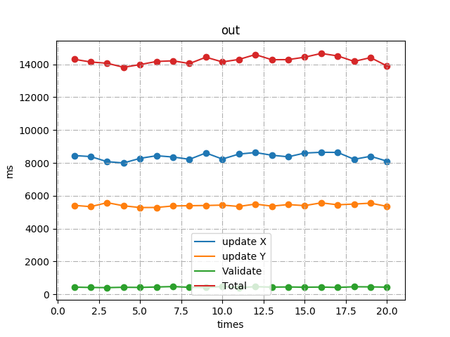

## ALS推荐系统优化

####组员：连浩丞、许秋晗、沈湘洁

- 数据读入优化
- 矩阵特征分析
- 稠密阵运算 ==> 稀疏阵运算
- 串行程序     ==> 并行程序 | update函数等价变换
- 编译优化
- 实测效率分析

### 数据读入优化

- 使用open函数先把数据映射到内存，再利用读字符串进行快速读入数据。

  ```c
  csr_matrix *load_mtx(char *filename) {
  #define MAX_BUFFER_SIZE 1024ll*1024*1024*2
      int m, n, nnz,idxi, idxj, fd = 0;
      if ((fd = open(filename, O_RDONLY)) < 0) printf("error\n");
      char *fp = mmap(NULL, MAX_BUFFER_SIZE, PROT_READ, MAP_SHARED, fd, 0);
      if (fp == NULL) {
          printf("error in mmap\n");
          return NULL;
      }
      unsigned totSz = sizeof(char) * (strlen(fp) + 1);
      char *bufferdIn = (char *) malloc(totSz);
      if (bufferdIn == NULL) {
          printf("Cannot alloc memory\n");
          return NULL;
      }
      memcpy(bufferdIn, fp, totSz);
      char *iter = bufferdIn;
      char line[105];
      do {
          sscanf(iter, "%[^\n]", line);
          iter += strlen(line) + 1;
      } while (line[0] == '%');
      sscanf(line, "%d %d %d", &m, &n, &nnz);
      int *cnt_row = (int *) calloc(sizeof(int), (m + 1));
      int *id_row = (int *) malloc(nnz * sizeof(int));
      int *id_col = (int *) malloc(nnz * sizeof(int));
      double fval;
      VALUE_TYPE *val = (VALUE_TYPE *) malloc(nnz * sizeof(VALUE_TYPE));
      for (int i = 0; i < nnz; i++) {
          idxi = readInt(&iter)-1;
          idxj = readInt(&iter)-1;
          fval = readDouble(&iter);
          ++cnt_row[idxi + 1];
          id_row[i] = idxi;
          id_col[i] = idxj;
          val[i] = fval;
      }
      for(int i = 0; i < m ; ++i)cnt_row[i + 1]+=cnt_row[i];
      csr_matrix*res = new_csr(m, n, nnz);
      nnz = cnt_row[m];
      memcpy(res->ia, cnt_row, (m + 1) * sizeof(int));
      memset(cnt_row, 0, (m + 1) * sizeof(int));
  
      for (int i = 0; i < nnz; ++i) {
          int offset = res->ia[id_row[i]] + cnt_row[id_row[i]];
          res->ja[offset] = id_col[i];
          res->val[offset] = val[i];
          cnt_row[id_row[i]]++;
      }
      // free tmp space
      free(id_col),free(val),free(id_row),free(cnt_row),free(bufferdIn);
      return res;
  }
  ```

### 矩阵特征分析

- 矩阵样式: (netflix太大了，画不出来.jpg)

  - 列数：480189
  - 行数：17770
  - 非零元个数：99072112
- [x] 稀疏阵：$\frac{99072112}{480189*17770} * 100\% = 1.161\% < 5\%$

### 稀疏阵运算

- 首先我自己实现了个`csr_sparse`的基础数据结构及运算库. 

  - 实际上这个系统只需要用到稀疏矩阵转置算法。

  ```c
  #include <sys/mman.h>
  #include <fcntl.h>
  #include <ctype.h>
  #include <pthread.h>
  #include <omp.h>
  #include <stdlib.h>
  #include <stdio.h>
  #include <string.h>
  
  #define min(a,b) (a)<(b)?(a):(b)
  #define RMALLOC(type,n) (type*)malloc(sizeof(type)*(n))
  #define MALLOC(p,type,n) type*p = RMALLOC(type, n)
  #ifndef VALUE_TYPE
  #define VALUE_TYPE float
  #endif
  typedef long ul;
  
  typedef struct {
      int m, n, nnz;
      int *ia, *ja;
      VALUE_TYPE *val;
  }csr_matrix;
  
  void csr_transpose(const csr_matrix*Mtx,csr_matrix *ret){
      ret->m = Mtx->n;
      ret->n = Mtx->m;
      ret->ia = calloc(sizeof(int),(Mtx->n+1));
      ret->ja = malloc(sizeof(int)*(Mtx->nnz));
      ret->val = malloc(sizeof(VALUE_TYPE)*(Mtx->nnz));
      int *cnt = (int*)calloc(sizeof(int),(Mtx->n+1));
      int nnz = Mtx->nnz;
      int row = 0,col;
      for(int i = 0 ; i < nnz ; ++i)ret->ia[Mtx->ja[i]+1]++;
      for(int i = 1 ; i <= Mtx->n ; ++i) ret->ia[i] += ret->ia[i - 1];
      for(int i = 0 ; i < nnz ; ++i){
          col = Mtx->ja[i];
          ret->ja[ret->ia[col]+cnt[col]] = row;
          ret->val[ret->ia[col]+cnt[col]] = Mtx->val[i];
          ++cnt[col];
          if(i+1==Mtx->ia[row+1])++row;
      }
      free(cnt);
  }
  
  void del_csr(csr_matrix *P){
      free(P->val);
      free(P->ja);
      free(P->ia);
  }
  
  csr_matrix* new_csr(int m,int n,int nnz){
      MALLOC(res,csr_matrix,1);
      res->m = m;
      res->n = n;
      res->nnz = nnz;
      res->ia = RMALLOC(int,m+1);
      res->ja = RMALLOC(int, nnz);
      res->val = RMALLOC(VALUE_TYPE, nnz);
      return res;
  }
  
  float readDouble(char **buffer) {
      while (!isdigit(**buffer)) ++*buffer;
      int flag = 1;
      if (*(*buffer - 1) == '-') flag = -flag;
      int ret = 0, dep = 0, dec = 1;
      while (isdigit(**buffer)) {
          ret = (ret << 1) + (ret << 3) + **buffer - '0';
          ++*buffer;
      }
      if (**buffer == '.') {
          ++*buffer;
          while (isdigit(**buffer)) {
              dep = (dep << 1) + (dep << 3) + **buffer - '0';
              ++*buffer;
              dec = (dec << 1) + (dec << 3);
          }
      }
      return flag * (ret + 1.0 * dep / dec);
  }
  
  ul readInt(char **buffer) {
      while (!isdigit(**buffer)) ++*buffer;
      ul flag = 1;
      if (*(*buffer - 1) == '-') flag = -flag;
      ul ret = 0;
      while (isdigit(**buffer)) {
          ret = (ret << 1) + (ret << 3) + **buffer - '0';
          ++*buffer;
      }
      return ret * flag;
  }
  ```
- 将与R和Rp相关的矩阵运算替换为稀疏矩阵运算.

  ```c
  void als_recsys(csr_matrix *csr, float *X, float *Y, int f, float lamda) {
      // create YT and Rp
      int iter = 0, nnz = csr->nnz, *ia = csr->ia, *ja = csr->ja, m = csr->m;
      float error, *v = csr->val;
      csr_matrix *csc = new_csr(csr->n, csr->m, csr->nnz);
      csr_transpose(csr, csc);
  
      float error_old = 0.0;
      float error_new;
      struct timeval t1, t2;
      double time_updatex = 0;
      double time_updatey = 0;
      double time_validate = 0;
      do {
          gettimeofday(&t1, NULL);
          update(csr, X, Y, f, lamda);
          gettimeofday(&t2, NULL);
          time_updatex += (t2.tv_sec - t1.tv_sec) * 1000.0 + (t2.tv_usec - t1.tv_usec) / 1000.0;
          gettimeofday(&t1, NULL);
          update(csc, Y, X, f, lamda);
          gettimeofday(&t2, NULL);
          time_updatey += (t2.tv_sec - t1.tv_sec) * 1000.0 + (t2.tv_usec - t1.tv_usec) / 1000.0;
          gettimeofday(&t1, NULL);
          error_new = 0;
  //#pragma omp parallel for reduction(+:error_new) //开启后因为float精度问题会相对串行有误差
          for (int i = 0; i < m; ++i) {
              float sum;
              for (int j = ia[i]; j < ia[i + 1]; ++j) {
                  sum = 0;
                  for (int k = 0; k < f; ++k)sum += X[i * f + k] * Y[ja[j] * f + k];
                  error_new += (sum - v[j]) * (sum - v[j]);
              }
          }
          error_new = sqrt(error_new / nnz);
          gettimeofday(&t2, NULL);
          time_validate += (t2.tv_sec - t1.tv_sec) * 1000.0 + (t2.tv_usec - t1.tv_usec) / 1000.0;
          error = fabs(error_new - error_old) / error_new;
          error_old = error_new;
          printf("iter = %i, error = %f, error_new = %f\n", iter, error, error_new);
          ++iter;
      } while (iter < 1000 && error > 0.0001);
  
      printf("\nUpdate X\t%5.2f ms\n", time_updatex);
      printf("Update Y\t%5.2f ms\n", time_updatey);
      printf("Validate\t%5.2f ms\n", time_validate);
      printf("Total use\t%5.2f ms\n", time_updatex + time_updatey + time_validate);
      del_csr(csc);
  }
  ```


### 串行程序 => 并行程序 | update函数等价变换

- 分析程序流程中可并行化的代码块。显然， update\*\_recsys函数中的外层循环的是前后无关的。所以update\*\_recsys可以被并行化。

- 分析两个update函数，注意到，两者流程基本相同，可以把它们统一替换成一个函数。

- 在调试过程中，我们注意到，在准备`smat`矩阵时，要消耗巨量的时间。

- 经过分析简化，下面的两个流程是等价的。**这里可以大幅度减小计算时间，可以贡献18倍的提速**

<table style="margin-left: auto; margin-right: auto;">
        <tr>
              <td>
                  <p>transpose(sYT, sY, nzr, f);</p>
               	  <p>matmat(smat, sYT, sY, f, nzr, f);</p>
          				<p>for (int i = 0; i < f; ++i)smat[i * f + i] += lamda;</p>
              </td>
              <td>
                  <p>memset(smat, 0, sizeof(float) * f * f);<p>
                  <p>for (int j = st; j < end; ++j) {<p>
                  <p>&nbsp&nbsp&nbsp&nbsp float *yn = Y + ja[j] * f;<p>
                  <p>&nbsp&nbsp&nbsp&nbsp for (int k = 0; k < f; ++k) {<p>
                  <p>&nbsp&nbsp&nbsp&nbsp&nbsp&nbsp&nbsp&nbsp float*yp=yn+k, val=*yp;<p>
                  <p>&nbsp&nbsp&nbsp&nbsp&nbsp&nbsp&nbsp&nbsp for (int l = k; l < f; ++l) smat[k * f + l] += val * *(yp++);<p>
                  <p>&nbsp&nbsp&nbsp&nbsp }<p>
                  <p>}<p>
                  <p>for (int i = 0; i < f; ++i) {<p>
                  <p>&nbsp&nbsp&nbsp&nbsp smat[i * f + i] += lamda;<p>
                  <p>&nbsp&nbsp&nbsp&nbsp for (int j = i + 1; j < f; ++j) smat[j * f + i] = smat[i * f + j];<p>
                   <p>}<p>
              </td>
          </tr>
      </table>

- 同时，考虑并行化时申请和释放空间的时间开销，先统一分配好空间，降低复杂度。

- ```c
void update(csr_matrix *csr, float *X, float *Y, int f, float lamda) {
      MALLOC(residual_all, float, f * block);
      MALLOC(y_all, float, f * block);
      MALLOC(p_all, float, f * block);
      MALLOC(q_all, float, f * block);
      MALLOC(smat_all, float, f * f * block);
      MALLOC(svec_all, float, f * block);
      int *ia = csr->ia, *ja = csr->ja, m = csr->m;
      float *v = csr->val;
  
  #pragma omp parallel for
      for (int u = 0; u < m; ++u) {
          int tid = omp_get_thread_num(), st=ia[u], end=ia[u+1];
          size_t sz = tid * f;
          float *smat = smat_all + sz * f;
          float *svec = svec_all + sz;
          float *residual = residual_all + sz;
          float *y = y_all + sz;
          float *p = p_all + sz;
          float *q = q_all + sz;
          float *xu = X + u * f;
          memset(smat, 0, sizeof(float) * f * f);
          for (int j = st; j < end; ++j) {
              float *yn = Y + ja[j] * f;
              for (int k = 0; k < f; ++k) {
                  float*yp=yn+k, val=*yp;
                  for (int l = k; l < f; ++l) smat[k * f + l] += val * *(yp++);
              }
          }
          for (int i = 0; i < f; ++i) {
              smat[i * f + i] += lamda;
              for (int j = i + 1; j < f; ++j) smat[j * f + i] = smat[i * f + j];
          }
          memset(svec, 0, sizeof(float) * f);
          for (int j = st; j < end; ++j) {
              float *yn = Y + ja[j] * f, val = v[j];
              for (int i = 0; i < f; ++i)svec[i] += val * *(yn++);
          }
          cg(smat, xu, svec, residual, y, p, q, f, 100, 0.00001);
      }
      free(smat_all), free(svec_all), free(residual_all), free(y_all), free(p_all), free(q_all);
  }
  ```

- 在并行条件下，不考虑Validate计算时间，update部分在全计算过程只需要14秒左右。下面看Validate优化。

  - 首先，分析算法，实际上Validate是计算$X*Y^T$与$R$的**欧几里得距离**。

  - 所以，针对R的非零元位置，**选择性的计算X与YT的向量点积**，可以大幅度提速。

    ```c
    error_new = 0;
    for (int i = 0; i < m; ++i) {
        float sum;
        for (int j = ia[i]; j < ia[i + 1]; ++j) {
            sum = 0;
            for (int k = 0; k < f; ++k)sum += X[i * f + k] * Y[ja[j] * f + k];
            error_new += (sum - v[j]) * (sum - v[j]);
        }
    }
    error_new = sqrt(error_new / nnz);
    ```

  - 后面考虑Validate的并行化，其实不难看出这个计算过程在理论上是可并行化的。只需要在并行结束后对error_new的值进行一次规约即可。但是这里存在一个问题，也是困扰我近一周的问题：**float精度超限**。

  - 起初我认为是并行化的规约问题，所以调整数据结构和等价变换算法用了2天时间。而且都失败了，无法定位到问题。

  - 后来我突发奇想，我用串行模拟出来并行化过程:

    ```c
    error_new = 0;
    int tb = m / block;
    for(int b=0;n<=block;++b){
        int sti = b*tb, edi = min(sti+tb, m);
        float sumb=0;
        for (int i = sti; i < edi; ++i) {
            float sum;
            for (int j = ia[i]; j < ia[i + 1]; ++j) {
                sum = 0;
                for (int k = 0; k < f; ++k)sum += X[i * f + k] * Y[ja[j] * f + k];
                sumb += (sum - v[j]) * (sum - v[j]);
            }
        }
        error_new += sumb;
    }
    error_new = sqrt(error_new / nnz);
    ```

    显然，这个流程和串行是等价的，尝试运行一下后，结果和开并行完全一样。我意识到是float精度炸了。考虑缩小每一块的大小，我把netflix的每一行当做一个块来算，最后对480k个结果进行规约，计算的结果还是和并行结果几乎相同。这说明，**至少有一列的点积和的值炸了float**。同时，我还尝试把error_new相关的计算全用double类型，结果也和并行化结果是一样的。

  - 在新的要求中，使用double计算error_new的结果无论串行并行，值都将收敛在0.918。所以后面我们对并行结果进行分析。

### 编译优化:

- 可以考虑O2或O3优化。 不过这里我鸡贼了一点, 使用Ofast优化, 让程序不严格按照代码执行，但是效率再加快一些。
- 同时，我还开启了一些不在O前缀的编译优化标志，比如：-fprofile-generate, -fprofile-use, -fprofile-correction, -unroll-loops, -frename-registers。 

### 实测效率分析

- 对程序连续测试20次，将结果绘制成如下图表。



