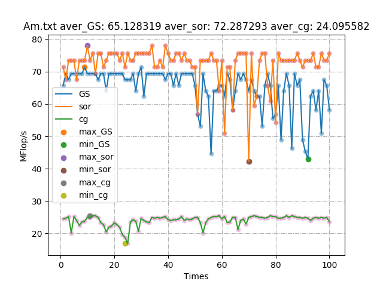

# 利用trsm算法解增广矩阵

## Ac -- 许秋晗

### 特征描述

- 矩阵图像

  

- 局部放大

  
  
- 对称性: 不对称

### 选择算法

对可能求解成功的算法一一尝试

- **Gauss算法**

  
  失败：残差过大

- **Lu_doolittle**

  

  成功

- **Lu_crout**

  

  成功


- **Cholesky**
  
  
  失败：残差过大
  
- **Jacobi**

  
  失败：残差过大
  
- **Gauss-Seidel**

  
  失败：残差过大
  
- **SOR**

  

  失败：残差过大

- **Conjugate**

  

  失败：残差过大

**经过比较可得，LU分解算法更好。**

### 选择原因

- 针对Lu_doolittle算法和Lu_crout算法，测评其综合性能并择优。

  

  |   doolittle平均性能   | 关系 |   crout平均性能   |
  | :-------------------: | :--: | :---------------: |
  |    1.6116 MFlop/s     |  \>  |  1.3363 MFlop/s   |
  | **doolittle最大性能** |  -   | **crout最大性能** |
  |    1.7464 MFlop/s     |  \>  |  1.5523 MFlop/s   |
  | **doolittle最小性能** |  -   | **crout最小性能** |
  |    1.2701 MFlop/s     |  \>  |  0.9314 MFlop/s   |

### 效率分析

|   doolittle平均性能   |
| :-------------------: |
|    1.6116 MFlop/s     |
| **doolittle最大性能** |
|    1.7464 MFlop/s     |
| **doolittle最小性能** |
|    1.2701 MFlop/s     |

### 代码

```objective-c
void LU_doolittle_2017011321(const float *A, float *x, const float *b, int n)
{
    float *At = (float *)malloc(sizeof(float) * n * n);
    memcpy(At, A, sizeof(float) * n * n);
    float *bt = (float *)malloc(sizeof(float) * n);
    memcpy(bt, b, sizeof(float) * n);
    float *L = (float *)malloc(sizeof(float) * n * n);
    float *U = (float *)malloc(sizeof(float) * n * n);
    memset(L, 0, sizeof(float) * n * n);
    for (int i = 0; i < n; i++)
    {
        L[i * n + i] = 1.0;
    }
    memset(U, 0, sizeof(float) * n * n);
    for (int i = 0; i < n; i++)
    {
        float pivot = At[i * n + i];
        for (int j = i + 1; j < n; j++)
        {
            float scale = -At[j * n + i] / pivot;
            At[j * n + i] = -scale;
            for (int k = i + 1; k < n; k++)
            {
                At[j * n + k] += scale * At[i * n + k];
            }
        }
    }

    float *y = (float *)malloc(sizeof(float) * n);

    for (int i = 0; i < n; i++)
        for (int j = 0; j < i; j++)
            L[i * n + j] = At[i * n + j];
    for (int i = 0; i < n; i++)
        for (int j = i; j < n; j++)
            U[i * n + j] = At[i * n + j];

    for (int i = 0; i < n; i++)
    {
        float sum = 0;
        for (int j = 0; j < i; j++)
            sum += L[i * n + j] * y[j];
        y[i] = (bt[i] - sum) / L[i * n + i];
    }
    for (int i = n - 1; i >= 0; i--)
    {
        float sum = 0;
        for (int j = i + 1; j < n; j++)
        {
            sum += U[i * n + j] * x[j];
        }
        x[i] = (y[i] - sum) / U[i * n + i];
    }
    free(At);
    free(bt);
    free(L);
    free(U);
    free(y);
}
```

### 优化策略

## Af -- 沈湘洁

### 特征描述

- 矩阵图像

  

- **对称性**: 不对称

- **对角元素分布**

  

  **从完整矩阵看，为稀疏矩阵，大部分集中在对角线上且连续分布，对角线两侧分布有间断元素。**

### 选择算法

由矩阵的非对称性，可排除cholesky算法；

对于除cg以外的迭代法，由于矩阵右下角存在连续0元素位于对角线上，使用时需要对于矩阵元素进行整理，行交换，再进行迭代。

由于零散分布的较小元素，高斯消元法由于浮点运算误差，极易出现错误的解，为避免不稳定现象的发生，舍弃此法。

- Lu算法

  - Doolittle 算法

    

  - Crout 算法

    

- cg迭代法

  

### 选择原因

- **仅有cg迭代法在误差的允许范围之内。**

- Af为稀疏矩阵，Lu对于Af缺乏优势；

  在元素的数值大小较为零散，差距稍大的情况下，高斯消元法不在适用；

  在使用迭代法时，由于对角线元素有连续为0的情况，换行较为繁琐在使用cg迭代法后，误差在允许范围内，且效率最高。

  由于此矩阵非对称正定矩阵，因此所求得二次泛函的极小值未必为该线性方程的解，但在尝试中，所解出的结果正确。
  
- **代码**

  ```objective-c
  void cg_2017011329(float *A, float *x, float *b, int n, int iter, int maxiter, float threshold){
     memset(x, 0, sizeof(float)*n);
     float *residual = (float*)malloc(sizeof(float)*n);
     float *y = (float*)malloc(sizeof(float)*n);
     memset(y, 0, sizeof(float)*n);
     float *p = (float*)malloc(sizeof(float)*n);
     float *q = (float*)malloc(sizeof(float)*n);
     memset(q, 0, sizeof(float)*n);
     iter = 0;
     float norm = 0;
     float rho = 0;
     float rho_1 = 0;
  
     matvec(A, x, y, n);
     for (int i = 0; i<n; i++)residual[i] = b[i] - y[i];
     do{
        rho = dotprod_2017011329(residual, residual, n);
        if (iter == 0)for (int i = 0; i<n; i++)p[i] = residual[i];
        else{
           float beta = rho / rho_1;
           for (int i = 0; i<n; i++)
            p[i] = residual[i] + beta*p[i];
        }
        matvec(A, p, q, n);
        float alpha = rho / dotprod_2017011329(p, q, n);
        for (int i = 0; i<n; i++)x[i] += alpha*p[i];
        for (int i = 0; i<n; i++)residual[i] += -alpha*q[i];
        rho_1 = rho;
        float error = vec2norm(residual, n);/// vec2norm(b, n);
        if (error<threshold)break;
     } while (*iter++<maxiter);
     free(residual);
     free(y);
     free(p);
     free(q);
  }
  ```

### 效率分析


|   Conjugate 平均效率   |
| :--------------------: |
|     1.4800 MFlop/s     |
| **Conjugate 最大效率** |
|     1.6356 MFlop/s     |
| **Conjugate 最小效率** |
|     1.3230 MFlop/s     |

### 优化策略

## Am -- 连浩丞

### 特征描述

- 矩阵图像（惊了）

  

- **对称性**: 结构对称，数值不对称

- 对角元素分布

  从小图上看，Am矩阵中元素多为0元素，属稀疏矩阵。经过**局部放大**后：

  

  有结论:
  
  - 对角线元素远大于非对角线元素；
  - 对角线两侧相应元素，上三角元素值稍大一些。

### 选择算法

- 优先考虑针对对称矩阵的算法如**Cholesky算法** 。
- 其次考虑迭代法，针对Am矩阵特点，迭代法的解可能收敛速度较快。
- 最后考虑使用其他直接法求解。

#### 对可能求解成功的算法一一尝试：

  - **Cholesky算法**

    

    失败: 超出误差

  - **迭代法:**

    - **Jacobi算法**

      
      
      成功
      
    - **GS算法**
    
      
      
      成功
      
    - **sor算法**
    
      
      
      成功

    - **Conjugate算法**

      

      成功

  - **直接法**
    
    - **Gauss算法**
    
      
    
      成功
      
    - **Lu_doolittle算法**
    
      
    
      成功
    
    - **Lu_crout算法**
    
      
    
      失败
    

  **最终，我选择了sor算法**

- 代码:

  ```objective-c
  void sor_2017011344(const float *A, float *x, const float *b, int n, int *iter, int maxiter, float threshold) {
      size_t sz = sizeof(float) * n;
      float w = 1.0f;
      memset(x,0,sz);
      for (*iter = 0; *iter < maxiter; ++*iter) {
          float norm = 0;
          for (int i = 0; i < n; ++i) {
              float xx = x[i], sum = 0;
              for (int j = 0; j < n; ++j)if (i != j) sum += A[pos(i, j)] * x[j];
              float tmp = (1 - w) * xx + (b[i] - sum) / A[pos(i, i)];
              if(isnormal(tmp))x[i] = tmp;
              norm = fabsf(xx-x[i]) > norm?fabsf(xx-x[i]):norm;
          }
          if (norm < threshold)break;
      }
  }
  ```

### 选择原因

由于直接法与jacobi算法效率明显低于迭代法，所以只针对**迭代法**测试其综合性能并**择优**。

|             GS             |            Sor             | cg                        |
| :------------------------: | :------------------------: | ------------------------- |
|  |  |  |

合并上表：



|   Sor平均性能   | 关系 |   Gs平均性能   | 关系 | cg平均性能 |
| :----------------------: | :---: | :---------------: | :----------------------: | :----------------------: |
|       72.29 MFlop/s       |  \>   |     65.13 MFlop/s     | \> | 24.10 MFlop/s |
| **Sor最大性能** | **关系** | **Gs最大性能** | **关系** | **cg最大性能** |
|      78.05 MFlop/s      |  \>   |    71.36 MFlop/s    | \> | 25.48 MFlop/s |
| **Sor最小性能** | **关系** | **Gs最小性能** | **关系** | **cg最小性能** |
|      42.33 MFlop/s      |  \<  |    43.06 MFlop/s    | \> | 16.87 MFlop/s |

### 效率分析

提取Sor算法性能表：


|   Sor平均性能   |
| :-------------: |
|  72.29 MFlop/s  |
| **Sor最大性能** |
|  78.05 MFlop/s  |
| **Sor最小性能** |
|  42.33 MFlop/s  |

### 优化策略

- 从语言特性上尽可能提升效率：

  - `for(int i=0;i<n;i++)` -> `for(int i=0;i<n;++i)`

  - `malloc(sizeof(float)*n)` -> 

    ```objective-c
    size_t sz = sizeof(float) * n;
    float *L = malloc(sz), *U = malloc(sz), *y = malloc(sz / n);
    ```
    
  - 宏函数（直接法可提升三倍效率）
  
    ```objective-c
    int pos(int i,int j,int n){
      return i*n+j;
    }
    ```
    ->
    
    ```objective-c
    #define pos(i,j) i*n+j
    ```
    
